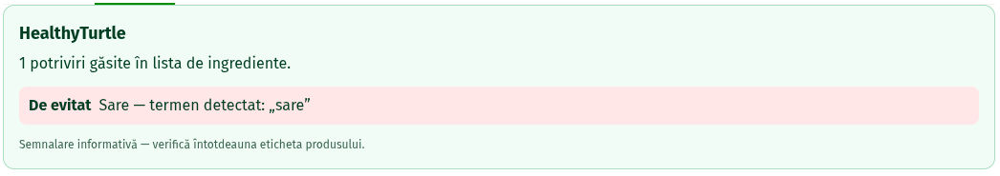

# HealthyTurtle

[](https://github.com/RipplyPear/healthy-turtle/actions/workflows/ci.yml)

A privacy-first Chrome extension that helps users review food ingredient lists on Freshful according to personal dietary preferences.

Originally built as a student scientific-communication project, HealthyTurtle is now a maintainable Manifest V3 extension built with TypeScript, automated tests, and a transparent rule-based analysis flow.



## What it does

1. You choose how to treat categories such as salt, sugar, gluten, lactose, eggs, fish, soy, and nuts.
2. On a Freshful product page, open the **Ingrediente** tab.
3. HealthyTurtle extracts only the ingredient-list section and compares it with the enabled rules.
4. A separate card explains each detected term as either **De evitat** or **De redus**.

The extension does not rewrite or hide Freshful's product content.

## Why this project

Food labels can be dense and difficult to scan quickly. HealthyTurtle is a small, transparent assistive layer: it surfaces terms a user has already chosen to watch for, while keeping the original product label visible.

## Technical highlights

- Chrome Extension Manifest V3
- TypeScript with strict type checking
- Rule-based ingredient analysis with Romanian-diacritic normalization
- ARIA-based Freshful adapter instead of brittle generated CSS selectors
- `chrome.storage.sync` for preferences
- Mutation observer for dynamic Freshful tab content
- Vite popup build plus a standalone esbuild bundle for the content script
- Vitest test suite covering normalization, matching rules, the Freshful adapter, and card rendering

## Architecture

| Area | Responsibility |
| --- | --- |
| `src/shared/preferences.ts` | Preference definitions, localized labels, and storage-friendly defaults |
| `src/rules/normalize.ts` | Romanian-aware text normalization and tokenization |
| `src/rules/ingredient-analyzer.ts` | Conservative term matching and false-positive exclusions |
| `src/adapters/freshful.ts` | Finds Freshful's ingredient panel through `tab` → `aria-controls` → `tabpanel` |
| `src/content/main.ts` | Connects the page adapter, preferences, analyzer, and observer |
| `src/content/insight-card.ts` | Renders the independent HealthyTurtle result card |
| `src/popup/` | Preference-management interface |
| `tests/` | Unit and DOM-level tests |

## Local setup

### Prerequisites

- Node.js 24 or newer
- Google Chrome or another Chromium-based browser

```bash
git clone https://github.com/RipplyPear/healthy-turtle.git
cd healthy-turtle
npm ci
```

### Quality checks

``` bash
npm run format:check
npm run typecheck
npm run lint
npm run test:run
npm run build
```

### Load the extension locally
1. Run `npm run build`.
2. Open `chrome://extensions`.
3. Enable Developer mode.
4. Choose Load unpacked.
5. Select the generated `dist/` directory.
6. Open a Freshful product page and select the Ingrediente tab.

After changing code, rebuild and click the refresh button for the extension on `chrome://extensions`.

## Privacy
- The extension runs only on `freshful.ro`.
- Preferences are stored with `chrome.storage.sync`.
- Ingredient text is analyzed locally in the browser.
- HealthyTurtle makes no external network requests and includes no analytics or telemetry.

## Scope and limitations

HealthyTurtle is an informational aid, not medical, nutritional, or allergy advice.

- Matching is heuristic and rule-based; it can miss terms or flag context-sensitive ones.
- Product information and page structure can change over time.
- Always check the official product label and packaging, especially for allergies or medical dietary restrictions.
- The current implementation supports Freshful and Romanian ingredient terminology.

## Roadmap
- [ ] Expand and document rule coverage
- [x] Add extension icon assets and choose an open-source license
- [ ] Add end-to-end browser tests
- [ ] Improve the popup visual design and accessibility
- [ ] Consider English localization after the Romanian interface is stable

## License

HealthyTurtle source code is licensed under the [MIT License](LICENSE). Third-party assets, if added, retain their own licenses.

## Academic background

The original student research paper is retained as historical project context:
[HealthyTurtle scientific paper](docs/research/healthy-turtle-scientific-paper.pdf).

It is a separate authors' work and is not covered by this repository's MIT
license. See [the research archive notice](docs/research/README.md).
